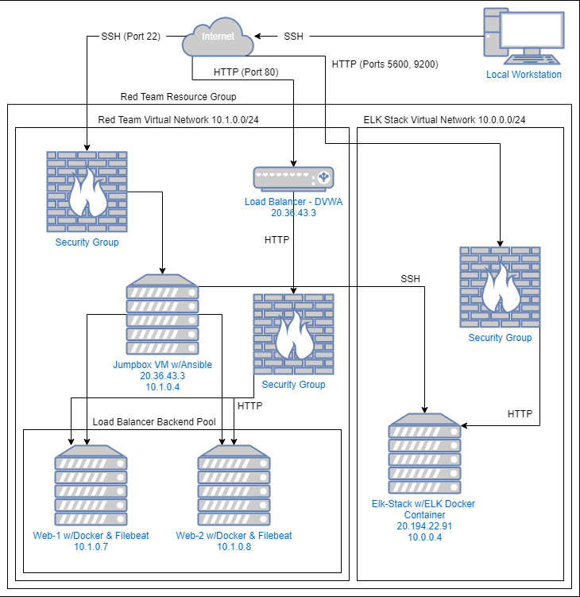
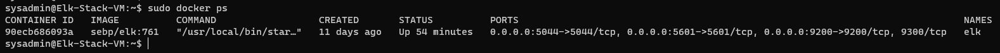

## Automated ELK Stack Deployment

The files in this repository were used to configure the network depicted below.



These files have been tested and used to generate a live ELK deployment on Azure. They can be used to either recreate the entire deployment pictured above. Alternatively, select portions of the YAML file may be used to install only certain pieces of it, such as Filebeat.
### Playbook - install-elk.yml
  ``` bash
  - name: Configure Elk VM with Docker
  hosts: elk
  remote_user: sysadmin
  become: true
  tasks:
    # Use apt module
    - name: Install docker.io
      apt:
        update_cache: yes
        force_apt_get: yes
        name: docker.io
        state: present

      # Use apt module
    - name: Install python3-pip
      apt:
        force_apt_get: yes
        name: python3-pip
        state: present

      # Use pip module (It will default to pip3)
    - name: Install Docker module
      pip:
        name: docker
        state: present

      # Use command module
    - name: Increase virtual memory
      command: sysctl -w vm.max_map_count=262144

      # Use sysctl module
    - name: Use more memory
      sysctl:
        name: vm.max_map_count
        value: '262144'
        state: present
        reload: yes

      # Use docker_container module
    - name: download and launch a docker elk container
      docker_container:
        name: elk
        image: sebp/elk:761
        state: started
        restart_policy: always
        # Please list the ports that ELK runs on
	published_ports:
          -  5601:5601
          -  9200:9200
          -  5044:5044

      # Use systemd module
    - name: Enable service docker on boot
      systemd:
        name: docker
        enabled: yes  
```

This document contains the following details:
- Description of the Topology
- Access Policies
- ELK Configuration
  - Beats in Use
  - Machines Being Monitored
- How to Use the Ansible Build


### Description of the Topology

The main purpose of this network is to expose a load-balanced and monitored instance of DVWA, the D*mn Vulnerable Web Application.

Load balancing ensures that the application will be highly available, in addition to restricting excessive to the network.
- Availability is the main focus of a load balancer by spreading the traffic across multiple servers. The main advantage of this is improving application responsiveness.

Integrating an ELK server allows users to easily monitor the vulnerable VMs for changes to the network and system files.
- Filebeat - Is used to forward and centralise log data. This monitors the log files and locations that you specify, collecting the log events and fowarding them to an index.
- Metricbeat - This collects metrics from the OS and from services running on the servers, taking the stats and reading and sending it to a centralised location, like Kibana, to be viewed.

The configuration details of each machine may be found below.

| Name      | Function  | IP Address | Operating System |
|-----------|-----------|------------|------------------|
| Jump-Box  | Gateway   | 10.1.0.4   | Linux - Unbuntu  |
| Web-1     | DVWA      | 10.1.0.5   | Linux - Unbuntu  |
| Web-2     | DVWA      | 10.1.0.6   | Linux - Unbuntu  |
| ELK-Stack | ELK       | 10.0.0.4   | Linux - Unbuntu  |

### Access Policies

The machines on the internal network are not exposed to the public Internet. 

Only the Jump-Box machine can accept connections from the Internet. Access to this machine is only allowed from the following IP addresses:
- My Personal Home PC IP

Machines within the network can only be accessed by the Jump-Box VM.
- Only the Jump-Box Virtual machine (20.36.43.3) was able to SSH into the ELK VM from within its Ansible container.

A summary of the access policies in place can be found in the table below.

| Name      | Publicly Accessible       | Allowed IP Addresses                |
|-----------|---------------------------|-------------------------------------|
| Jump-Box  | Yes                       | Personal Home PC IP                 |
| Web-1     | No (HTTP access from Web) | 10.1.0.4 / HTTP from Web to DVWA    |
| Web-2     | No (HTTP access from Web) | 10.1.0.4 / HTTP from Web to DVWA    |
| ELK-Stack | No (HTTP access from Web) | 10.1.0.4 / HTTP from Web to ELK App |

### Elk Configuration

Ansible was used to automate configuration of the ELK machine. No configuration was performed manually, which is advantageous because:
- The automation process is advantageous because it can be repeated if needed, it is guaranteed to work immediately and consistently. In case of issues or expansion a fresh and new instance can quickly and efficiently be installed. And this also allows easy OS and software updates.

The playbook implements the following tasks:
- Install Docker.io
- Install Python3
- Install Docker Module
- Increase avaliable memory of the VM to support the ELK stack
- Download and Install the Docker ELK container

The following screenshot displays the result of running `docker ps` after successfully configuring the ELK instance.



### Target Machines & Beats
This ELK server is configured to monitor the following machines:
- Web-1: 10.1.0.5
- Web-2: 10.1.0.6

We have installed the following Beats on these machines:
- FileBeat
- MetricBeat

These Beats allow us to collect the following information from each machine:
- FileBeat forwards and centralises log files and events. Typically you would find information similiar to; types of files downloaded and which geographic locations visisted the site.
- MetricBeat collects metrics from the operating system and services running on the server. These would look like CPU or Memory specifications and conditions.

### Using the Playbook
In order to use the playbook, you will need to have an Ansible control node already configured. Assuming you have such a control node provisioned: 

SSH into the control node and follow the steps below:
- Copy the playbook.yml file to the Ansible container in the `/etc/ansible` folder.
- Update the `/etc/ansible/hosts` file to include the following below

```
[webservers]
10.1.0.5 ansible_python_interpreter=/usr/bin/python3
10.1.0.6 ansible_python_interpreter=/usr/bin/python3 

[elk]
10.0.0.4 ansible_python_interpreter=/usr/bin/python3
```
- Navigate to the `/etc/ansible/ansible.cfg` and set the remote_user parameter to the admin user of the webservers (sysadmin, in my case).

- Run the playbook,and navigate to the Kibana site in your browser to check that the installation worked as expected.

- Kibana can be accessed at `http://{elk-public-server-ip}:5601/app/kibana`
